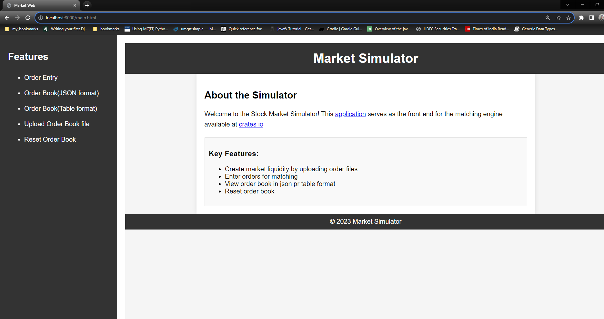

Welcome to market web, the web interface for the <a href="https://crates.io/crates/matching_engine"> Matching Engine </a>
that supports two matching algorithms viz., FIFO and Prorata.

For more information on these algorithms , please visit <a href="https://corporatefinanceinstitute.com/resources/career-map/sell-side/capital-markets/matching-orders/">CFI
institute web site</a>

Market web is a stand alone web server that you can start on your desktop/laptop that runs Windows 10 or higher. You
will need to install cargo setup to run the application using cargo.
Alternately, you can download the <a href = "https://github.com/tksundar/market-web/tree/master/bin/market-web.exe">market-web.exe</a> from the app's repository

Here is a sample scree grab of the landing page of the app

 
